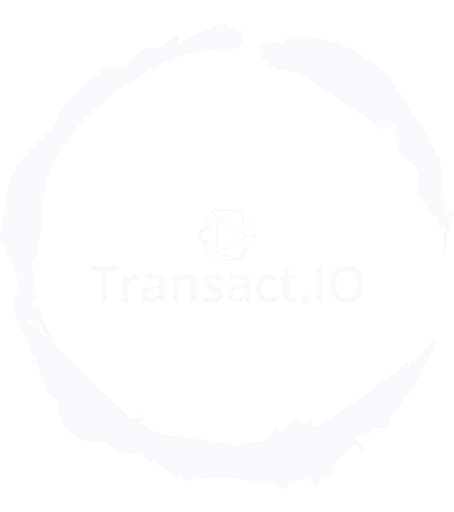

<p style="text-align: center">
  
</p>

[](https://github.com/erik1608/transactio/blob/main/LICENSE)
[](https://www.codacy.com/gh/erik1608/transactio/dashboard?utm_source=github.com&amp;utm_medium=referral&amp;utm_content=erik1608/transactio&amp;utm_campaign=Badge_Grade)

This is the RestAPI part of a POC application, that is capable of performing transactions using linked Amazon Alexa user
voice profile
and the registered biometric credential used to validate the account owner.

## <p style="text-align: center;" >Use scenario</p>

* The user creates an account using the **Transact.IO** client on their Android (Currently only platform supported)
  device.
* The user navigates to "**Settings**" and creates a Biometric credential.
* The user opens Alexa application and navigates to the "**Skill & Games**" view.
* Searches for the **Transact.IO** skill and enables it.
* Above step will opt the user to **Transact.IO** application and will require a consent of account information use.
* Once accepted the user will automatically be navigated back to the Amazon Alexa app
* The linkage will be completed successfully if the user accepts the consent of account information use.
* Send a friend request to another user, for the ability to send them credits.
* If the friend request has been approved ask Alexa to send money to the new friend.

That is it!

## <p style="text-align: center;" >Building the RestAPI application</p>

### Prerequisites

* JDK (Version: 11.0.3 or higher)
* Maven (Version: 3.8.1)
* Tomcat (Version: 10.0.27 or higher) - Optional
* PostgreSQL (Version: 14 or higher)

### Process

#### 1. Using Spring Boot

Open a terminal at the project root directory.
Run the following command to download the dependencies, compile and run the RestAPI:

```commandline
mvn spring-boot:run
```

The server will start up at default ``:8080`` port.
To modify the server port, edit the <a href="src/main/resources/application.yml">application.yml</a> and the port in the
following property. E.g.:

```yaml
server:
  port: 80
```

#### 2. Using Tomcat web server.

Although, the project can run in a standalone environment, it can also be run in the <u>**Tomcat**</u> webserver
environment.
Run the following command in the project root directory:

```commandline
mvn clean package
```

Once the command finished the execution in the "**target/**" folder within the project root directory. <br>
In the directory there will be a generated "**transactio-${project.version}.war**" file, which can be deployed to
the <u>**Tomcat**</u> server.

## Note:

This project is not an enterprise solution and was built only for educational purposes!<br>
If you have any notes or questions to ask feel free to <a href="mailto:erikterdavtyan@gmail.com">email</a> me.
